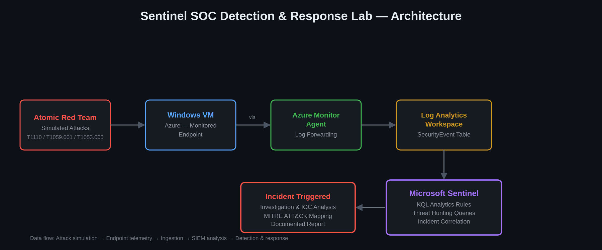

# Sentinel SOC Detection & Response Lab

## Overview
End-to-end SOC simulation: deployed Microsoft Sentinel, engineered custom
detections mapped to MITRE ATT&CK, validated them against real attack
simulations using Atomic Red Team, and investigated/documented the
resulting incidents.

## Repository Structure

sentinel-soc-lab/
├── README.md
├── architecture-diagram.png
├── detections/
│ ├── T1110-bruteforce.kql
│ ├── T1059.001-powershell.kql
│ └── T1053.005-scheduled-task.kql
├── incidents/
│ ├── incident-01-bruteforce.md
│ ├── incident-02-powershell.md
│ └── incident-03-scheduled-task.md
├── threat-hunt/
│ └── hunt-01-[technique-name].md
└── screenshots/
├── sentinel-workspace-overview.png
├── incident-queue.png
├── analytics-rule-config.png
└── atomic-test-execution.png

## Architecture
- Microsoft Sentinel (Log Analytics workspace)
- Windows VM (Azure) as the monitored endpoint, connected via Azure Monitor Agent
- Atomic Red Team for attack simulation

## Detections Built

| Technique | MITRE ID | Detection Method |
|---|---|---|
| Brute-force authentication | T1110 | KQL — failed logon threshold (Event 4625) |
| Malicious PowerShell execution | T1059.001 | KQL — suspicious command-line flags (Event 4688) |
| Persistence via scheduled task | T1053.005 | KQL — scheduled task creation (Event 4698) |

See `/detections` for the full KQL queries.

## Attack Simulation & Validation
Each detection was validated by executing the corresponding technique with
Atomic Red Team against the monitored VM, confirming the analytics rule
fired as expected and generated an incident in Sentinel.

_Details and screenshots: see `/incidents` and `/screenshots`._

## Threat Hunt
A hypothesis-driven KQL hunt was conducted for a technique not covered by
the built analytics rules, to demonstrate detection-gap discovery beyond
automated alerting.

See `/threat-hunt` for the full writeup.

## Incident Reports
Full writeups (timeline, IOCs, root cause, remediation) for each detected
incident are in `/incidents`.

## Lessons Learned
_To be completed once the lab is fully built and tested._

## Disclaimer
This lab was built in an isolated Azure environment for educational and
skill-demonstration purposes only. All attack simulations were performed
against systems owned and controlled by the author.
