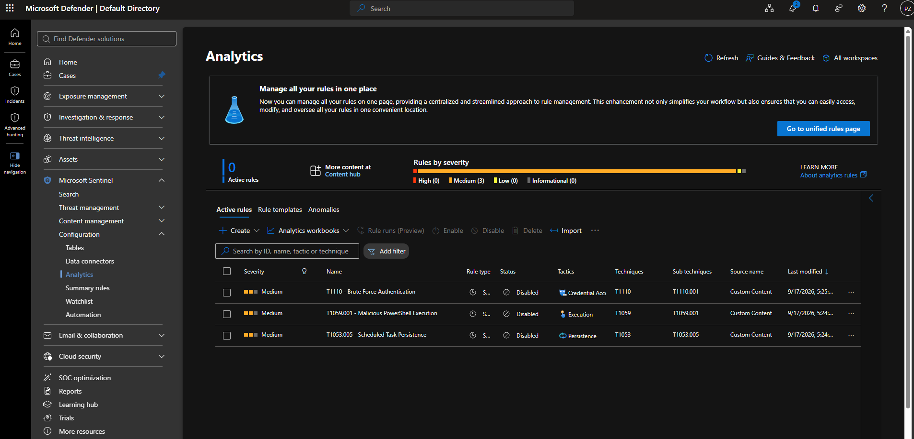
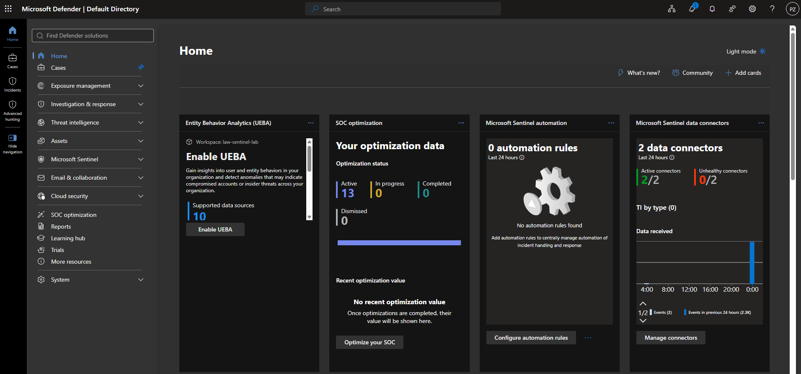

# Sentinel SOC Detection & Response Lab

## Overview
End-to-end SOC simulation: deployed Microsoft Sentinel, engineered custom
detections mapped to MITRE ATT&CK, validated them against real attack
simulations using Atomic Red Team (and manual simulation where Atomic tests
required infrastructure not present in this single-VM lab), and
investigated/documented the resulting incidents.

## Repository Structure

    sentinel-soc-lab/
    ├── README.md
    ├── architecture-diagram.png
    ├── detections/
    │   ├── T1110-bruteforce.kql
    │   ├── T1059.001-powershell.kql
    │   └── T1053.005-scheduled-task.kql
    ├── incidents/
    │   ├── incident-01-bruteforce.md
    │   ├── incident-02-powershell.md
    │   └── incident-03-scheduled-task.md
    ├── threat-hunt/
    │   └── hunt-01-lateral-movement-rdp.md
    └── screenshots/
        ├── sentinel-workspace-overview.png
        ├── incident-queue.png
        ├── analytics-rule-config.png
        └── atomic-test-execution.png

## Architecture
- Microsoft Sentinel (Log Analytics workspace, Canada Central)
- Windows Server 2022 VM (Azure) as the monitored endpoint, connected via
  Azure Monitor Agent (AMA) and the "Windows Security Events via AMA"
  data connector
- Atomic Red Team / manual PowerShell simulation for attack execution

## Detections Built

| Technique | MITRE ID | Detection Method | Result |
|---|---|---|---|
| Brute-force authentication | T1110 | KQL — failed logon threshold (Event 4625) | ✅ Fired — Incident #29 |
| Malicious PowerShell execution | T1059.001 | KQL — suspicious command-line flags (Event 4688) | ✅ Fired — Incident #28 |
| Persistence via scheduled task | T1053.005 | KQL — scheduled task creation (Event 4698) | ✅ Fired — Incident #27 |

See `/detections` for the full KQL queries and tuning notes.

## Attack Simulation & Validation
Each detection was validated by executing the corresponding technique against
the monitored VM (`vm-victim-01`), confirming the analytics rule fired as
expected and generated a real incident in Sentinel.

*Analytics rule configuration in Microsoft Sentinel/Defender.*

*Attack simulation being executed against the victim VM.*

*Sentinel workspace overview showing ingested data and active analytics rules.*

*Incident queue showing all three detections fired as real Sentinel incidents.*

_Full detail and evidence for each fired incident: see `/incidents`._

## Threat Hunt
A hypothesis-driven KQL hunt for lateral movement via RDP was conducted for
a technique not covered by the built analytics rules, to demonstrate
detection-gap discovery beyond automated alerting.

See `/threat-hunt/hunt-01-lateral-movement-rdp.md` for the full write-up.

## Incident Reports
Full write-ups (timeline, evidence, analysis, response actions, lessons
learned) for each detected incident are in `/incidents`:
- [Incident 01 — Brute Force Authentication](incidents/incident-01-bruteforce.md)
- [Incident 02 — Malicious PowerShell Execution](incidents/incident-02-powershell.md)
- [Incident 03 — Scheduled Task Persistence](incidents/incident-03-scheduled-task.md)

## Lessons Learned
- **Command-line auditing is off by default.** Event 4688 fires, but the
  `CommandLine` field stays blank unless command-line process auditing is
  explicitly enabled via registry — without it, the PowerShell detection
  is ineffective.
- **Analytics rules are time-windowed.** Test/simulation data must fall
  within both the query's internal `ago()` window and the rule's own
  "lookback" setting, or the rule won't match even with correct logic.
- **Standard Atomic Red Team tests for brute-force (T1110.001) generally
  assume Active Directory** and aren't directly usable against a single
  standalone VM — substituted with manual local PowerShell credential loops
  to simulate the same behavior.
- **Wide lookback windows on scheduled rules can cause incident duplication.**
  A 3-day lookback on a rule running every 5 minutes caused repeated
  re-firing on the same underlying data, inflating the incident count.
  Rules should use a lookback tightly scoped to their run frequency
  (e.g. `ago(1h)` for an hourly rule).
- **Not every event field is reliably populated in the flattened
  `SecurityEvent` schema.** Event 4698 (scheduled task creation) does not
  expose the creating account in the `Account` column — that detail is
  only available by parsing the raw event XML, a gap documented as a
  detection improvement in Incident 03.

## Disclaimer
This lab was built in an isolated Azure environment for educational and
skill-demonstration purposes only. All attack simulations were performed
against systems owned and controlled by the author.
