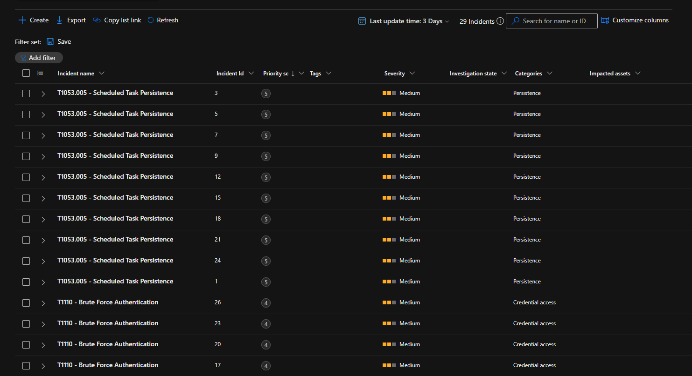

# Incident 01: Brute-Force Authentication

## Summary
A controlled brute-force simulation was run against `vm-victim-01` to validate the T1110 detection rule. Six failed logon attempts were generated against the local `azureuser` account using a deliberately incorrect password. The resulting Event ID 4625 entries were confirmed flowing into the Microsoft Sentinel workspace and independently validated against the detection query in Advanced Hunting. The corresponding Sentinel analytics rule has been created and enabled; incident generation from a live scheduled run is still pending confirmation.

**MITRE ATT&CK:** T1110 — Brute Force (simulated as T1110.001 — Password Guessing)
**Detection rule:** `detections/T1110-bruteforce.kql`
**Severity:** Medium
**Status:** Detection logic validated (query confirmed against real data); Sentinel incident firing — pending

**MITRE ATT&CK:** T1110 — Brute Force
**Detection rule:** `detections/T1110-bruteforce.kql`
**Severity:** *(TBD)*
**Status:** *(TBD — Open / Contained / Resolved)*

## Timeline
| Time | Event |
|---|---|
| Sep 15, 2026, 11:09 AM (VM local time) / 4:09 AM UTC | Six failed logon attempts generated locally via PowerShell against `azureuser` |
| Sep 15, 2026 | Event ID 4625 confirmed in Windows Event Viewer on `vm-victim-01` |
| Sep 15, 2026 | Same events confirmed ingested into `SecurityEvent` table in `law-sentinel-lab` via direct KQL query |

## Detection Trigger
Query validated manually in Advanced Hunting, returning:

| IpAddress | Computer | FailedAttempts | LatestAttempt |
|---|---|---|---|
| ::1 | vm-victim-01 | 6 | Sep 15, 2026 4:09:14 AM |

## Investigation
The standard Atomic Red Team test for T1110.001 requires Active Directory infrastructure (domain controller, LDAP, or Azure AD), which is out of scope for this single-VM lab. As a substitute, failed logons were generated directly via a local PowerShell loop, using `Start-Process` with a deliberately incorrect credential against the real local account. This produced a genuine Event ID 4625 for each attempt, which is the same event type a real brute-force attack — network-based or local — would generate, making it a valid substitute for testing the detection logic itself.

The `IpAddress` field shows `::1` (loopback), reflecting that the attempt originated locally on the VM rather than over the network — an expected artifact of this substitution method, not a limitation of the detection query.

## Indicators of Compromise (IOCs)
| Type | Value |
|---|---|
| Source IP | ::1 (loopback — local simulation) |
| Target Account | azureuser |
| Host | vm-victim-01 |
| Failure Reason | Unknown user name or bad password (Status 0xC000006D) |

## Root Cause
Not applicable — this was a deliberate, controlled simulation for detection validation, not a real compromise attempt.

## Remediation
Not applicable to this simulation. In a production environment, standard remediation for genuine brute-force activity would include: enforcing account lockout thresholds, requiring MFA, and investigating the source IP for further malicious activity if external.

## Lessons Learned
- Sentinel analytics rules are time-windowed: test data used for query validation must fall within both the query's internal `ago()` filter and the rule's "Lookup data from the last" setting, or the rule will silently find nothing even with valid detection logic. Widening both temporarily (e.g. to `ago(3d)`) is a useful diagnostic step when testing against older data.
- Official Atomic Red Team tests for some techniques (like T1110.001) assume enterprise infrastructure (AD, Azure AD) that a minimal single-VM lab won't have — a direct local simulation of the same underlying Windows event is a reasonable, documented substitute.
- VM local time and Log Analytics `TimeGenerated` (UTC) differ by several hours; cross-referencing Event Viewer timestamps against Sentinel data requires accounting for this offset.
