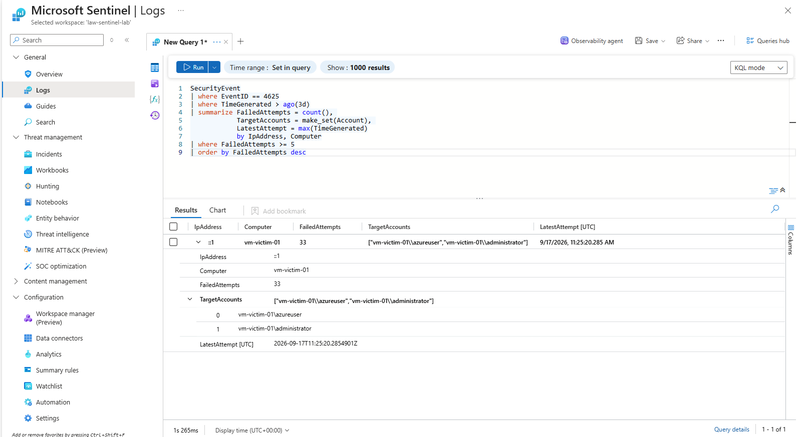

# Incident 03: Persistence via Scheduled Task

## Summary
*(fill in after execution — one-paragraph overview of what happened and outcome)*

**MITRE ATT&CK:** T1053.005 — Scheduled Task/Job: Scheduled Task
**Detection rule:** `detections/T1053.005-scheduled-task.kql`
**Severity:** *(TBD)*
**Status:** *(TBD — Open / Contained / Resolved)*

## Timeline
| Time (UTC) | Event |
|---|---|
| *TBD* | Atomic Red Team test executed against monitored VM |
| *TBD* | Analytics rule triggered, incident created in Sentinel |
| *TBD* | Analyst triage began |
| *TBD* | Root cause confirmed |
| *TBD* | Incident closed |

## Detection Trigger
*(fill in after execution — screenshot/description of the alert as it appeared in Sentinel's incident queue)*

## Investigation
*(fill in after execution — task name, action path, trigger conditions, account context that created the task)*

## Indicators of Compromise (IOCs)
| Type | Value |
|---|---|
| Task Name | *TBD* |
| Action Path | *TBD* |
| Creating Account | *TBD* |
| Host | *TBD* |

## Root Cause
*(fill in after execution)*

## Remediation
*(fill in after execution — task deletion, account review, baseline task inventory established, etc.)*

## Lessons Learned
*(fill in after execution)*
